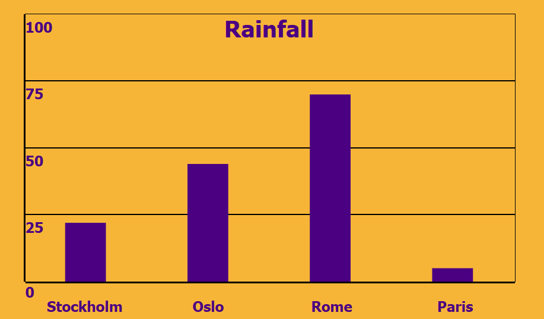
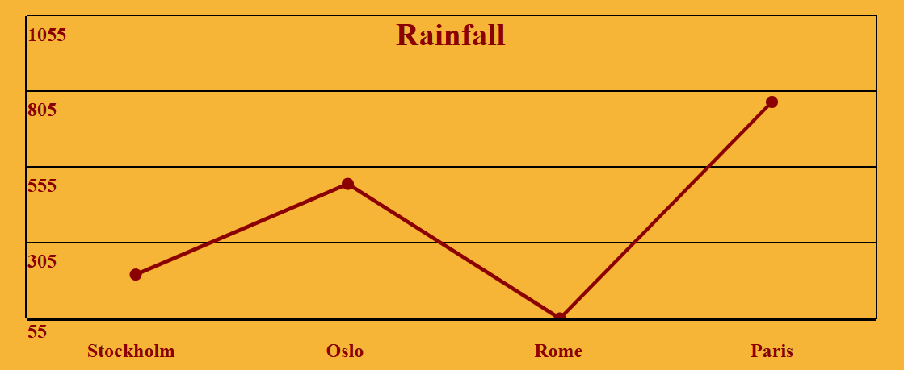

# Chart Generator Library
## Introduction
This library generates bar charts, line graphs, and pie charts from user data. The charts are rendered with SVG elements, and can be styled by passing an options object with user-defined values.  
  



  

## Installation
```
npm install @aangelinux/charts
```
In your program:  
```
import { Chart } from '@aangelinux/charts'
```
  

## Usage
### Methods
To use the interface, you create an instance of class Chart. The interface contains three main methods:  
- createBarChart(data, options)
- createLineGraph(data, options)
- createPieChart(data, options)
  
Each method accepts two parameters and returns a div element containing the chart. Only one chart can be rendered per Chart instance; if you call one of these methods on a Chart instance that already contains a rendered chart, it will be overwritten.  
  
To create a simple bar chart with a custom style:  
```
const data = [
    {
        name: "Stockholm",
        value: 22
    },
    {
        name: "Oslo",
        value: 14
    }
]

const linearOptions = {
    width: 500,
    height: 250,
    title: "Monthly Rainfall By City",
    color: "blue",
    font: "Monaco, monospace"
}

const chart = new Chart()
const rainfallChart = chart.createBarChart(data, linearOptions)
```
  
---
Static style rules are stored in a default CSS template, which can be replaced by calling:  
- replaceStaticCSS(template)  
  
To pass a custom stroke color for pie charts:  
```
const template = `
<style>
    #slice {
        stroke-color: blue;
        stroke-width: 4;
    }
</style>
`

chart.replaceStaticCSS(template)
```
You will need to rewrite all static CSS rules if you want to use your own template, or use from the default template: [template](https://github.com/aangelinux/1DV610-L2/blob/main/lib/styles/cssTemplate.js)
  
---
Passing an options object is optional. It is also not required to pass an options object containing all the keys defined in the schema, the chart will use the default options as defined in the table below.  
The options object has two different schemas depending on the type of chart being created. See **Options Schemas** and **Data Schema** below.  
  
Data and options are automatically validated before rendering the chart, and an exception is thrown if they fail any validation checks. If you want to validate either object before creating a chart, you can call these methods:
- validateData(data)
- validateOptions(options)
  
Example:  
```
chart.validateData(newData)
chart.validateOptions(newOptions)
```
  
Finally, you can call any of these helper methods:  
- get chart()
- resetChart()
  
### Default options
| Key    | Values            |
| ------ | ----------------- |
| width  | 550               |
| height | 300               |
| radius | 150               |
| title  | Data Chart        |
| color  | darkred           |
| font   | Monaco, monospace |
   
  
    
## Valid Objects
| Object  | Type   | Elements                   | Limit  |
| ------- | ------ | -------------------------- | ------ |
| Data    | Array  | Objects                    | 2 - 10 |
| Data[i] | Object | Keys (see Data Schema)     | 2      |
| Options | Object | Keys (see Options Schemas) | 0 - 5  |
  
---
### Data Schema
| Key   | Type   | Allowed values           |
| ----- | ------ | ------------------------ |
| name  | string |                          |
| value | number | (-1 000 000) - 1 000 000 |
  
---
### Options Schemas
#### Options: Linear Charts
| Key    | Type   | Allowed values                                            |
| ------ | ------ | --------------------------------------------------------- |
| width  | number | 200 - 1000                                                |
| height | number | 150 - 800                                                 |
| title  | string |                                                           |
| color  | string | darkred, red, orange, yellow, green, blue, indigo, violet |
| font   | string | (Monaco, monospace), Arial, Verdana, Tahoma, Times New Roman, Georgia|
  
---
#### Options: Radial Charts
| Key    | Type   | Allowed values                                   |
| ------ | ------ | ------------------------------------------------ |
| radius | number | 100 - 400                                        |
| title  | string |                                                  |
| font   | string | (Monaco, monospace), Arial, Verdana, Tahoma, Times New Roman, Georgia |
  
### Errors
If any exceptions are thrown, the chart will not be rendered.  
Object values that are outside the defined ranges will throw a RangeError.  
Object keys that are not of the correct types will throw a TypeError.  
Object keys that are invalid will throw a SyntaxError.  
  
  
## Contributions
Contributions are welcome:  

- Fork the repository and create a separate branch.
- Make your changes, write clear commit messages.
- Open a pull request and describe your changes.
- For bugfixes/requests, open an issue.
   
  
## Version
1.0.1


## License
Licensed under the MIT License.  
  

## Badges


